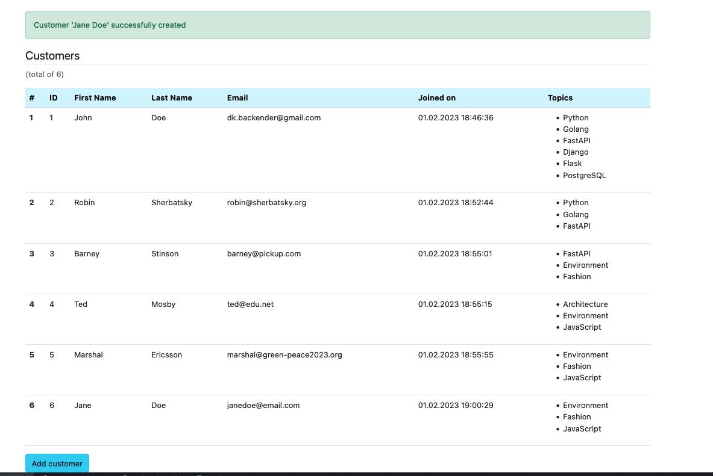

### Emailer service

### Сервис для рассылки электронных писем по темам для подписчиков

#### Функционал:

1. Создание и просмотр тем для подписок
2. Создание и просмотр подписчиков
   (в карточке подписчика указаны интересные ему темы, имя, фамилия, email)
3. Управление макетом для рассылки - макет расположен по следующему
   пути в структуре проекта: `emailer/app/templates/app/email_template.html`
   В макете заданы переменные, которые автоматически заполняются значениями полей из БД:

- `first_name` - имя подписчика
- `last_name` - фамилия подписчика
- `created_at` - дата и время создания учетной записи подписчика
- `title` - заголовок рассылки
- `topic` - тема рассылки
- `body` - тело (содержание) рассылки

Пример отрисовки актуального макета с заполненными переменными доступен по адресу в сервисе `/template/`
Скриншоты см. ниже.

4. Создание и просмотр рассылок:
    1. В рассылке указывается заголовок, тема, расширенное описание рассылки, флаг старта рассылка сразу после создания
    2. После создания рассылки с установленным флагом `run immediately` сервис отправляет заполненный шаблон
       как электронное письмо всем подписчикам темы рассылки в фоновом процессе.
    3. Если флаг не был установлен, то стартующий 1 раз в минуту фоновый процесс найдет в базе все
       ранее не запущенные рассылки и обработает их.

5. Просмотр отправленных рассылок и детализация до конкретного пользователя в рассылке:
    1. дата и время отправки
    2. ошибки при отправлении
    3. дата и время открытия отправленного письма

   Каждое письмо отправляется в текстовом и html форматах.
   При открытии html-версии встроенный в письмо javascript выполняет http-запрос в сервис для фиксации в БД времени
   открытия письма подписчиком.

#### Роуты сервиса:

- `/customer` - список подписчиков
- `/customer/new` - создание подписчика
- `/topic` - список тем
- `/topic/new` - создание темы
- `/newsletter` - список рассылок
- `/newsletter/new` - создание рассылки (и ее старт при необходимости)
- `/tracking/<newsletter_id>` - список отправок писем по индивидуальной рассылке
- `/open/<tracking_id>` - запрос на фиксацию открытия письма подписчиком
- `/template` - получение отрендеренного актуального макета с заполненными тестовыми данными
- `/admin` - встроенный admin-интерфейс фреймворка Django

#### Стэк сервиса (основные компоненты):

- Python 2.7.18
- Django 1.11
- PostgreSQL 14
- Celery 4.4
- Boostrap 5.2
- jQuery 3.6
- Redis 6.2

#### Необходимые настройки:

В корне проекта в файле `.env` необходимо указать актуальные значения настроек:

- credentials к БД
- credentials к почтовому ящику, с которого планируется отправка писем
- порты, на которых необходимо поднять компоненты сервиса
- желаемые данные будущего администратора сервиса:
  - имя пользователя
  - email
  - пароль (не `admin1234`, посложнее)

Некоторые настройки уже заполнены по умолчанию.

#### Необходимая инфраструктура:

- docker
- docker-compose
- Доступ в интернет с машины, на которой разворачивается сервис

#### Деплой сервиса (на машине должны быть установлены docker и docker-compose):

Сервис поднимается на порту `APP_EXPOSED_PORT` из настроек.
При старте сервис:
- ожидает готовность БД
- выполняет миграции
- создает администратора-суперпользователя (если он не был создан ранее)
- поднимается на порту `APP_EXPOSED_PORT` из настроек

#### Команды управления сервисом (в корне проекта в терминале): 
- сборка и старт сервиса - `make run`
- остановить сервис - `make stop`
- удалить сервис - `make kill`

#### Логи:
Для мониторинга событий в сервисе доступны логи:
- `docker-compose logs -f app` - логи django-приложения  
- `docker-compose logs -f celery` - логи celery 
(фоновое выполнение и отложенный запуск задач)
- `docker-compose logs -f db` - логи postgres
- `docker-compose logs -f redis` - логи redis
  
#### Ниже приведены скриншоты UI-части сервиса:

